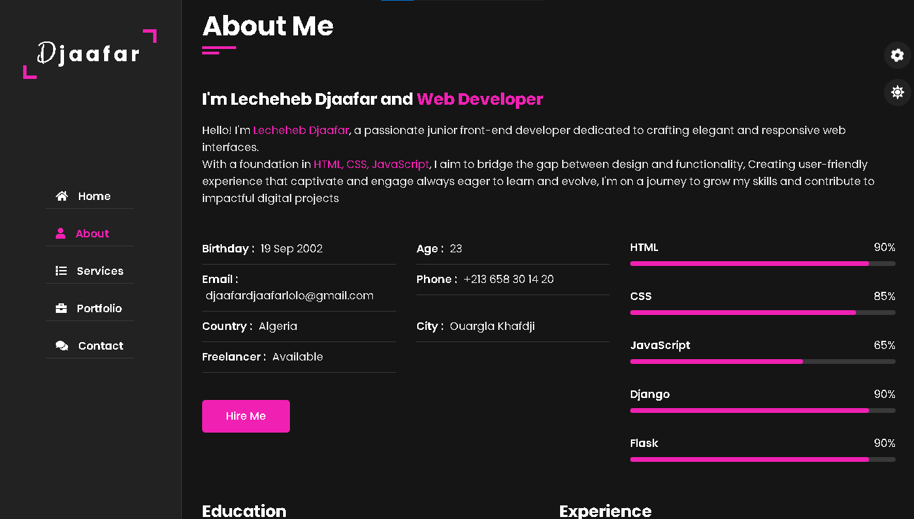
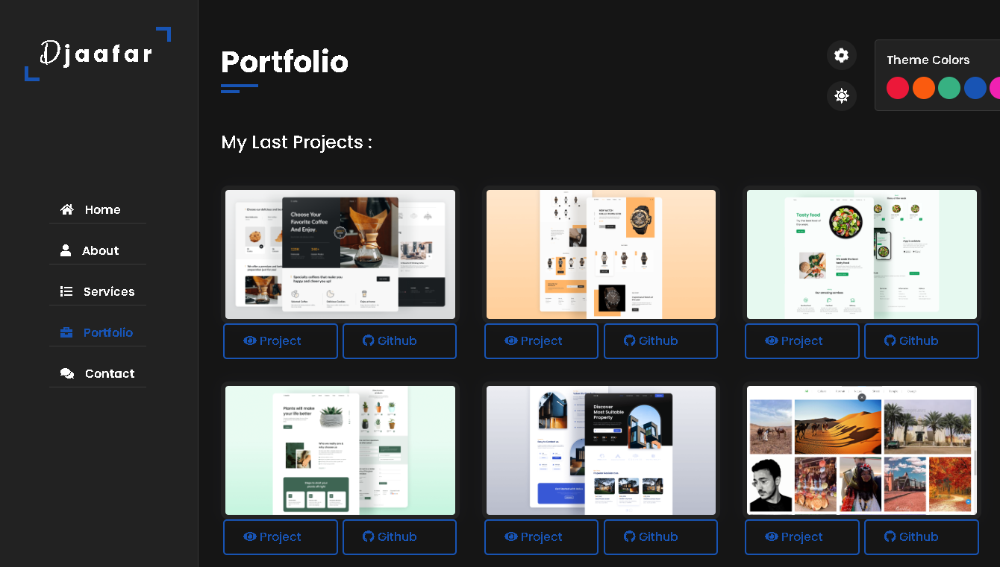

# 🚀 Portfolio Website


## 🌍 Live Demo
🔗 [Visit My Portfolio](https://lechehebdjaafar.github.io/MyPortgolio/)

## 📌 About the Project
This is my personal portfolio website built using **HTML, CSS, and JavaScript**. It showcases my skills, projects, and experience in a clean and interactive design.

## 🎨 Features
- **Fully Responsive** 📱 Works on all devices
- **Modern UI/UX** 🎨 Clean and elegant design
- **Interactive Animations** ✨ Smooth transitions
- **Projects Showcase** 🏗️ Display of my best work
- **Contact Form** 📩 Easy way to reach out to me

## 📸 Screenshots
### 🔹 Homepage


### 🔹 Projects Section


## 🛠️ Technologies Used
- **HTML5** 🏗️ Structuring the website
- **CSS3** 🎨 Styling and animations
- **JavaScript** ⚡ Interactivity and dynamic content

## 🚀 Installation & Usage
1. Clone the repository:
   ```bash
   git clone https://github.com/LechehebDjaafar/MyPortgolio
   ```
2. Open the `index.html` file in a browser.

## 💡 Future Improvements
- Add a blog section 📝
- Implement dark mode 🌙
- Improve animations 🚀

## 📬 Contact Me
Feel free to reach out if you have any questions or feedback!

📱 LinkedIn: [linkedin.com](https://www.linkedin.com/in/lecheheb-djaafar-226594348/)  
---
⭐ If you like this project, give it a star on GitHub! ⭐
